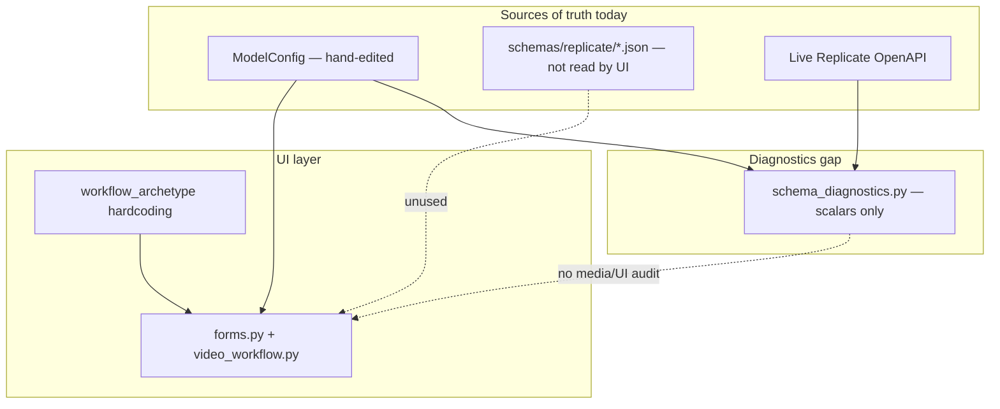
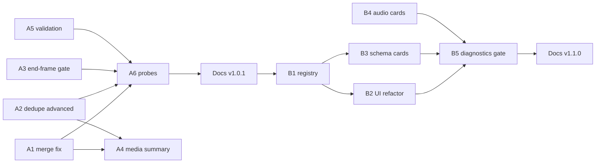

# IMPLEMENTATION_VER-1.0.1-capability-remediation.md — Model capability registration & UI remediation

**Target versions**: v1.0.1 (critical fixes + UX) · v1.1.0 (structural capability layer)  
**Status**: Phase A complete (v1.0.1 shipped 2026-06-14) · Phase B (v1.1.0) pending  
**Investigation date**: 2026-06-14  
**Live schema check**: All 27 configured models fetched from Replicate OpenAPI (non-paid)

---

## Goal

Fix capability registration and Video-tab media UI so that:

1. **What the UI shows is what the API receives** — no silent drops of uploaded frames or references.
2. **Capabilities are honest** — optional vs required, conditional rules (end frame needs start frame), and mutual exclusions are visible before Generate.
3. **The system is maintainable** — one auditable capability contract drives config, validation, UI placement, and diagnostics (replacing hand-synced triple sources).

This plan addresses the user-reported Kling failure (cartoon start/end frames uploaded; output was unrelated realistic footage) and the broader audit findings from `scripts/model_diagnostics.py` plus a custom capability diff across `ModelConfig`, schema cards, live Replicate schemas, and UI render paths.

---

## User-reported symptom (confirmed root cause)

**Observed**: Kling (Omni or O1) showed “Start frame image (optional)” and “End frame image (optional)” in **Frames and references**. User uploaded cartoon images for both. Output looked like pure text-to-video — realistic character, unrelated scene.

**Confirmed bug**: Duplicate file uploaders. Preview column (`render_multimodal_media_sections`) sets `_uploaded_start_image` / `_uploaded_end_image`. The **More settings** expander renders the same params again and **always assigns `None`** when empty, overwriting preview uploads before `normalize_file_kwargs` runs.

**Simulated payload (Kling 3 Omni, prompt + preview uploads only)**:

| After form merge | Keys in Replicate payload | `generation_mode` |
|------------------|---------------------------|-------------------|
| Normal UX (preview uploads, advanced empty) | `prompt`, `mode`, `duration`, … — **no frames** | `text_to_video` |
| Preview uploads, advanced not rendered | `start_image`, `end_image`, `prompt`, … | `image_to_video` |

The generation succeeded as **prompt-only T2V**, which matches the user’s experience. This is not wrong Kling parameter naming (`start_image` / `end_image` are correct API keys).

**How to verify a past run**: History → check `generation_mode` (`text_to_video` = frames dropped) and whether `parameters_json` contains `start_image` / `end_image` metadata.

---

## Architectural problem

Three sources of truth, none driving the UI automatically:



**Consequence**: `model_diagnostics.py` can pass while the UI misleads users and drops uploads.

---

## Issue inventory

Severity: **P0** = user-facing bug / wasted paid call risk · **P1** = misleading UX · **P2** = maintainability · **P3** = intentional deferral, document only

### P0 — Critical (fix in v1.0.1)

| ID | Issue | Affected models | Evidence |
|----|-------|-----------------|----------|
| P0-1 | **Silent upload wipe**: advanced file uploaders overwrite preview `_uploaded_*` with `None` | `kling-v3-omni`, `kling-o1`, `seedance-2.0`, `seedance-2.0-fast` | `forms.py` advanced loop; local simulation |
| P0-2 | **Duplicate upload widgets** for same API param (preview + advanced) | Same four multimodal models | `models_config.py` `advanced_params` duplicates `file_input_params` handled in `video_workflow.py` |
| P0-3 | **No pre-flight confirmation** that frames/refs are in the payload | All video models with media | Request preview optional; Generate does not surface attached media |

### P1 — Misleading UX / validation gaps (fix in v1.0.1)

| ID | Issue | Notes |
|----|-------|-------|
| P1-1 | End frame offered without start frame | Kling `end_image`, Seedance `last_frame_image` require start; submit validation exists but UI does not gate |
| P1-2 | “(optional)” on end frame implies independent use | Plain-English copy should say “only works with a start frame” |
| P1-3 | `reference_audios` on Seedance requires image or video ref | API description; not validated in `validation.py` / `replicate_payload.py` |
| P1-4 | Kling 4k + `reference_video` conflict | Help text only; no pre-submit block |
| P1-5 | Kling O1 missing `mutual_exclusion` for rules documented on Omni | Config gap if O1 gains `generate_audio` later; align validation with API |
| P1-6 | Workflow filter “Animate an image” lists models where start frame is optional extra | Tags are capability hints, not strict mode gates — needs clearer model captions |

### P2 — System / diagnostics (v1.0.1 foundations → v1.1.0 completion)

| ID | Issue | Notes |
|----|-------|-------|
| P2-1 | `schema_diagnostics.py` ignores `file_input_params` vs remote media params | Passes when UI exposure is wrong |
| P2-2 | Schema cards (18/27) not consumed at runtime | Good for agents/docs; zero drift protection |
| P2-3 | No `capabilities` module — UI logic scattered in archetype branches | `forms.py`, `video_workflow.py`, `audio_forms.py`, `threed_tab.py` |
| P2-4 | Audio TTS models use UI `prompt` → API `text` alias | Diagnostics warn `ui_param_missing_remote`; alias not modeled |
| P2-5 | Nine audio models lack `schemas/replicate/*.json` cards | `music-2.5`, `stable-audio-2.5`, `lyria-2`, four Inworld/MiniMax speech, `chatterbox`, `elevenlabs-v3` |

### P3 — Intentional omissions (document, do not “fix” silently in v1.0.1)

| ID | Capability | Model | Action |
|----|------------|-------|--------|
| P3-1 | `keyframe_images`, `keyframe_positions` | `aleph-2` | Deferred per `output_notes`; mark `ui_exposure: deferred` in schema card |
| P3-2 | `audio` sync input | `wan-2.7-t2v`, `wan-2.5-i2v-fast` | `supports_audio=True` but no uploader; defer or add in v1.1+ |
| P3-3 | `audio_prompt` voice clone | `chatterbox` | Defer unless user requests |
| P3-4 | `addons` mesh | `rodin` | Defer |
| P3-5 | Trellis advanced scalars | `trellis-2` | Many remote params unexposed by design; keep collapsed / deferred |

### Not bugs (audit false positives)

- `happyhorse-1.0`, `gen-4.5`: `image` hidden in text mode via `generation_modes` — correct.
- 3D `image` in `balanced_params` but not `file_input_params` — rendered via standard image uploader path.

---

## Per-model snapshot (video multimodal — highest risk)

| Model | API frame keys | UI duplicate upload? | Wipe bug? | End needs start? |
|-------|----------------|----------------------|-----------|------------------|
| `kling-v3-omni` | `start_image`, `end_image` | Yes (4 params) | Yes | Yes (API + partial validation) |
| `kling-o1` | `start_image`, `end_image` | Yes (4 params) | Yes | Yes |
| `seedance-2.0` | `image`, `last_frame_image` | Yes (refs only in advanced) | Yes for refs; start in preview only | Yes |
| `seedance-2.0-fast` | `image`, `last_frame_image` | Yes (5 params) | Yes | Yes |

---

## Remedy plan

### Phase A — v1.0.1 critical fixes & intuitive UI (execute first)

**Outcome**: Kling/Seedance frame uploads work reliably; users see whether media is attached before paying.

#### A1. Fix upload merge semantics (`forms.py`)

- In all advanced/balanced file-uploader loops: **only set `_uploaded_{param}` when `uploaded is not None`** (match `video_workflow.py` preview behavior).
- Add helper `_set_upload_kwarg(kwargs, param, uploaded)` used by preview + controls to avoid divergence.

#### A2. Remove duplicate media from advanced lists (`models_config.py`)

For `workflow_archetype == "multimodal_video"`, remove from `advanced_params` any key already in `file_input_params` that preview handles:

| Model | Remove from `advanced_params` |
|-------|-------------------------------|
| `kling-v3-omni` | `start_image`, `end_image`, `reference_images`, `reference_video` |
| `kling-o1` | same |
| `seedance-2.0` | `reference_images`, `reference_videos`, `reference_audios` (`image` stays in balanced — already skipped in controls via `skip_balanced`) |
| `seedance-2.0-fast` | `image`, `last_frame_image`, `reference_images`, `reference_videos`, `reference_audios` |

Keep scalar advanced params (`multi_prompt`, `keep_original_sound`, etc.).

#### A3. Conditional end-frame UI (`video_workflow.py`)

- Disable/hide “Add an end frame” until start frame upload is present.
- Dynamic caption: “End frame only applies when you also provide a start frame.”
- Label start frame: “Start frame (optional — turns this into image-to-video)” instead of bare “(optional)”.

#### A4. Pre-generate media summary (`forms.py` or small `src/ui/media_summary.py`)

Above **Generate**, show a compact line when media is attached, e.g.:

- “Attached: start frame · end frame” or “Attached: none (text-to-video)”
- Derive from `_uploaded_*` keys after merge, before `normalize_file_kwargs`.

Auto-refresh when **Preview request payload** is used; optionally show `generation_mode` from dry-run.

#### A5. Extend validation (`validation.py`, `replicate_payload.py`)

- Seedance: reject `last_frame_image` without `image` (extend existing `end_image` check to `last_frame_image`).
- Seedance: reject `reference_audios` without `reference_images`, `reference_videos`, `image`, or `last_frame_image`.
- Kling Omni: reject `mode == "4k"` with `reference_video` set.
- Ensure validation runs on normalized kwargs in both `video_tab.py` and generate path (already mostly true).

#### A6. Regression probes

- Add local probe in `generation_service.run_local_safety_checks` or new `scripts/capability_audit.py`: simulate preview-only uploads for Kling + Seedance Fast; assert payload contains frame keys.
- Extend `model_diagnostics.py` with `duplicate_upload_paths` and `upload_wipe_risk` checks → **error** severity.

**Files touched (Phase A)**:

- `src/ui/forms.py`
- `src/ui/video_workflow.py`
- `src/models_config.py`
- `src/validation.py`
- `src/replicate_payload.py`
- `src/schema_diagnostics.py` (new checks)
- `scripts/model_diagnostics.py` (wire audit)
- Optional: `src/ui/media_summary.py`

**Verification (Phase A)**:

```bash
uv run python -m compileall -q app.py src
uv run ruff check .
uv run python scripts/model_diagnostics.py
# Manual: Streamlit — Kling Omni, upload start+end in Frames only, Preview payload shows start_image/end_image, History mode = image_to_video
```

---

### Phase B — v1.1.0 capability registry (structural cleanup)

**Outcome**: One module defines what each model accepts; UI and diagnostics read it instead of archetype spaghetti.

#### B1. New module `src/capability_registry.py`

```python
@dataclass
class MediaInputSpec:
    param: str              # exact API key
    role_label: str         # plain-English UI label
    file_types: list[str]
    placement: Literal["preview", "balanced", "advanced", "mode_gated"]
    required: bool = False
    requires: tuple[str, ...] = ()      # e.g. end_image requires start_image
    mutex_with: tuple[str, ...] = ()  # e.g. image mutex reference_images
    intentional_skip: bool = False    # P3 deferrals with reason
    skip_reason: str = ""
```

- Build specs from `ModelConfig` + schema card overlays initially.
- Export `get_media_specs(model) -> list[MediaInputSpec]` and `get_ui_placement(spec)`.

#### B2. Refactor UI to consume specs

- Replace hardcoded branches in `render_multimodal_media_sections` with `placement == "preview"` specs.
- `forms.py` balanced/advanced loops skip params owned by preview placement.
- Single upload site per param — enforced by registry, not convention.

#### B3. Schema card extensions

Add to each `schemas/replicate/<model>.json`:

```json
"capability_overlay": {
  "ui_exposure": {
    "keyframe_images": { "status": "deferred", "reason": "Complex keyframe UX" }
  },
  "param_aliases": { "prompt": "text" }
}
```

Refresh script: fetch Replicate OpenAPI → update card → diff against `ModelConfig`.

#### B4. Audio schema cards

Add nine missing cards under `schemas/replicate/`; record `param_aliases` for TTS `text`.

#### B5. Diagnostics as release gate

- `ghost_ui_media` (UI param ∉ remote) → error
- `missing_ui_media` without `intentional_skip` → warning
- `duplicate_upload_paths` → error
- `conditional_unenforced` → warning

---

### Phase C — UX polish (can ship with B or as v1.1.x)

| Item | Description |
|------|-------------|
| C1 | Model selector caption: one line on frame/reference support (“Supports start+end frame I2V”) |
| C2 | Multimodal section title: “Frames and references (optional)” + short explainer of T2V vs I2V |
| C3 | Seedance: inline hint that refs need prompt tags `[Image1]` / `<<<image_1>>>` per model |
| C4 | History remix: restore frame upload hints (“re-upload start/end frame”) |
| C5 | Request preview: show human “Attached media” line at top of preview block |

---

## Execution order (DAG)



**Rule**: Complete Phase A and verify before starting Phase B. Phase B should not block shipping A.

---

## Version & documentation checklist

### v1.0.1 (after Phase A)

- [x] `pyproject.toml` → `1.0.1`
- [x] `CHANGELOG.md` — P0 Kling/Seedance upload fix, validation, media summary
- [x] `README.md` — note if user-facing behavior changed
- [x] `ROADMAP.md` — post-1.0 remediation row
- [x] This file — mark Phase A **Complete** with date

### v1.1.0 (after Phase B)

- [ ] `pyproject.toml` → `1.1.0`
- [ ] `CHANGELOG.md`, `README.md`, `ROADMAP.md`
- [ ] `AGENTS.md` — only if adding convention (e.g. capability registry is canonical)
- [ ] Mark Phase B complete in this file

---

## Out of scope (unless explicitly requested later)

- Aleph keyframe UI (P3-1)
- Wan audio sync upload (P3-2)
- Chatterbox `audio_prompt` (P3-3)
- fal.ai provider layer
- pytest/CI suite (lightweight probes only per project norms)
- Paid live Replicate verification runs

---

## Success criteria

**v1.0.1 done when**:

1. User can upload Kling start+end frames in **Frames and references only**; preview payload and History show `image_to_video` with frame metadata.
2. `scripts/model_diagnostics.py` fails on reintroduced duplicate-upload or wipe patterns.
3. End frame cannot be selected without start frame in UI.
4. Plain-English copy explains frame behavior without API parameter names in main labels.

**v1.1.0 done when**:

1. `capability_registry` is the single placement authority for media inputs on Video tab.
2. All 27 models have schema cards or documented `intentional_skip`.
3. Capability audit runs in diagnostics with zero errors on `master`.

---

## References

- Prior audit conversation: Kling frame symptom, full 27-model capability diff
- `IMPLEMENTATION_VER-0.6.10.md` — original multimodal UI design (advanced duplicates were not intended to shadow preview)
- `UI_ASSESSMENT_PRE_V1.md` — layout context (preview column owns creative inputs)
- `src/ui/forms.py`, `src/ui/video_workflow.py`, `src/models_config.py`, `src/schema_diagnostics.py`
- `scripts/model_diagnostics.py`

---

**Next step after review**: Execute Phase A (A1→A2→A3→A5→A4→A6), then docs bump to v1.0.1. Phase B scheduled as v1.1.0 unless user wants a single larger pass.